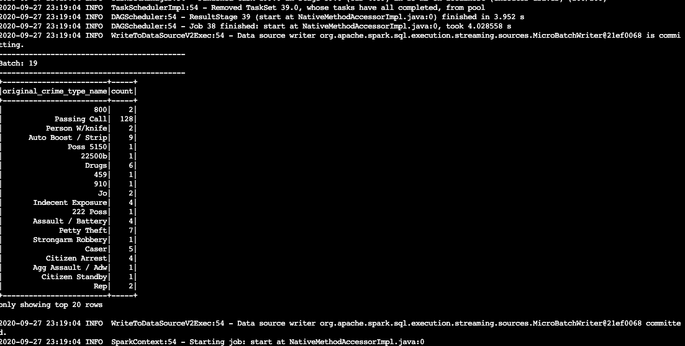

# udacitystream

**Take a screenshot of your kafka-consumer-console output. You will need to include this screenshot as part of your project submission.**

** a screenshot of your progress reporter after executing a Spark job. **

**Take a screenshot of the Spark Streaming UI as the streaming continues. **

Question:
How did changing values on the SparkSession property parameters affect the throughput and latency of the data?

What were the 2-3 most efficient SparkSession property key/value pairs? Through testing multiple variations on values, how can you tell these were the most optimal?
